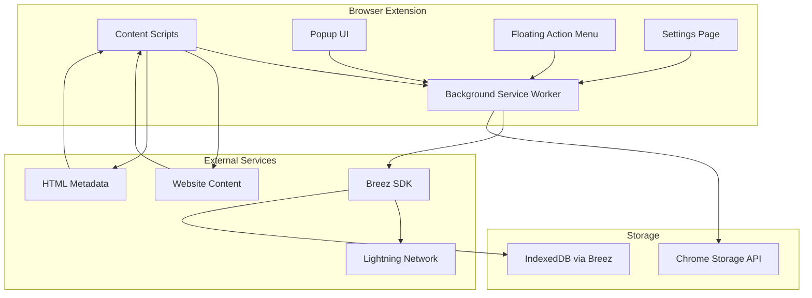

# Design Document

## Overview

The Lightning Network Tipping Browser Extension is a Chrome extension that enables seamless Bitcoin tipping via the Lightning Network across websites. The extension operates in two modes: detection mode (universal tip scanning) and posting mode (domain-specific tip appending). It supports both built-in wallet functionality via Breez SDK and external wallet integration through QR codes, providing maximum flexibility for users.

The extension uses a standardized tip format `[lntip:lnurl:<lnurl>:<amount1>:<amount2>:<amount3>]` that works universally across all platforms, ensuring interoperability while maintaining user privacy and control.

## Architecture

### High-Level Architecture



### Component Architecture

The extension follows Chrome Extension Manifest V3 architecture with the following components:

1. **Background Service Worker**: Handles Breez SDK operations, storage management, and cross-component communication
2. **Content Scripts**: Injected into web pages for tip detection, appending, and UI overlay management
3. **Popup UI**: Main wallet interface for balance, deposits, withdrawals, and settings
4. **Floating Action Menu**: Always-visible quick access menu for common actions
5. **Settings Page**: Comprehensive configuration interface

## Components and Interfaces

### 1. Background Service Worker (`background.js`)

**Responsibilities:**
- Breez SDK Spark initialization and wallet management
- Lightning Network payment processing via Breez SDK Spark APIs
- LNURL-pay operations using Breez SDK Spark LNURL methods
- Storage operations (encrypted wallet data, settings, blacklists)
- Message passing coordination between components
- Domain whitelist/blacklist management

**Key Interfaces:**
```javascript
// Wallet Management using Breez SDK Spark
interface WalletManager {
  initializeWallet(mnemonic?: string): Promise<void>
  getBalance(): Promise<number>
  
  // Using Breez SDK Spark methods:
  receivePayment(amount: number, description: string): Promise<string>  // receive_payment.html
  sendPayment(bolt11: string): Promise<boolean>                        // send_payment.html
  listPayments(): Promise<Payment[]>                                   // list_payments.html
  
  // LNURL operations:
  parseLnurl(lnurl: string): Promise<LnUrlPayRequestData>             // parse.html + lnurl_pay.html
  payLnurl(reqData: LnUrlPayRequestData, amount: number, comment?: string): Promise<boolean> // lnurl_pay.html
  receiveLnurlPay(): Promise<string>                                   // receive_lnurl_pay.html
}

// Storage Management
interface StorageManager {
  saveEncryptedWallet(data: WalletData, pin: string): Promise<void>
  loadEncryptedWallet(pin: string): Promise<WalletData>
  saveDomainSettings(domain: string, status: DomainStatus): Promise<void>
  saveBlacklist(lnurls: string[]): Promise<void>
}

// Message Handler
interface MessageHandler {
  handleContentScriptMessage(message: ContentMessage): Promise<any>
  handlePopupMessage(message: PopupMessage): Promise<any>
  handleFloatingMenuMessage(message: FloatingMessage): Promise<any>
}
```

### 2. Content Scripts (`content.js`)

**Responsibilities:**
- DOM scanning for tip detection (text and metadata)
- Tip request auto-appending in posting contexts
- Tipping UI overlay management
- Platform-specific posting context detection
- Floating action menu injection

**Key Interfaces:**
```javascript
// Tip Detection
interface TipDetector {
  scanForTips(): TipRequest[]
  scanMetadata(): TipRequest[]
  isBlacklisted(lnurl: string): boolean
  showTipPrompt(tip: TipRequest, element: HTMLElement): void
}

// Posting Context Detection
interface PostingDetector {
  detectPostingContext(): PostingContext | null
  appendTipRequest(context: PostingContext, tipString: string): void
  getPlatformSpecificSelectors(): string[]
  useHeuristicDetection(): PostingContext[]
}

// UI Management
interface UIManager {
  createTipOverlay(tip: TipRequest): HTMLElement
  createFloatingMenu(): HTMLElement
  showQRCode(lnurl: string, amount: number): void
  showDomainStatus(domain: string, status: DomainStatus): void
}
```

### 3. Popup UI (`popup.html`, `popup.js`)

**Responsibilities:**
- Wallet dashboard (balance, transaction history)
- Deposit/withdrawal interfaces
- Basic settings access
- Onboarding flow

**Key Components:**
- Balance display with refresh capability
- QR code generator for deposits
- Transaction history list
- Quick settings toggles
- Onboarding wizard

### 4. Floating Action Menu (`floating-menu.js`)

**Responsibilities:**
- Always-visible quick access to core functions
- Domain management controls
- Blacklist status indicators
- Quick wallet actions

**Key Features:**
- Draggable positioning
- Color-coded domain status (gray/green/red)
- Compact menu with essential actions
- Blacklist detection indicators

### 5. Settings Page (`settings.html`, `settings.js`)

**Responsibilities:**
- Comprehensive configuration management
- LNURL configuration (custom vs built-in wallet)
- Default amount settings
- Domain whitelist/blacklist management
- Security settings

## Data Models

### Core Data Structures

```typescript
interface TipRequest {
  lnurl: string
  suggestedAmounts: [number, number, number]
  source: 'text' | 'metadata'
  element?: HTMLElement
  isBlacklisted: boolean
}

interface WalletData {
  mnemonic: string
  lnurl?: string
  customLNURL?: string
  balance: number
  transactions: Transaction[]
}

interface UserSettings {
  defaultPostingAmounts: [number, number, number]
  defaultTippingAmounts: [number, number, number]
  customLNURL?: string
  useBuiltInWallet: boolean
  floatingMenuEnabled: boolean
  autoLockTimeout: number
}

interface DomainSettings {
  [domain: string]: DomainStatus
}

enum DomainStatus {
  UNMANAGED = 'unmanaged',    // Gray
  WHITELISTED = 'whitelisted', // Green
  DISABLED = 'disabled'        // Red
}

interface BlacklistData {
  lnurls: string[]
  lastUpdated: number
}

interface Transaction {
  id: string
  type: 'send' | 'receive'
  amount: number
  description?: string
  timestamp: number
  status: 'pending' | 'completed' | 'failed'
}
```

### Storage Schema

```typescript
// Chrome Storage Local
interface ChromeStorageSchema {
  // Encrypted with user PIN
  encryptedWallet: string
  
  // User preferences
  userSettings: UserSettings
  domainSettings: DomainSettings
  blacklistData: BlacklistData
  
  // Session data
  isUnlocked: boolean
  lastActivity: number
}

// IndexedDB (via Breez SDK)
interface BreezStorageSchema {
  // Managed by Breez SDK
  walletState: any
  channelData: any
  paymentHistory: any
}
```

## Error Handling

### Error Categories and Strategies

1. **Network Errors**
   - Retry mechanism with exponential backoff
   - Offline queue for pending operations
   - User-friendly error messages with suggested actions

2. **Wallet Errors**
   - Insufficient balance warnings with deposit prompts
   - Channel liquidity issues with explanations
   - Key management errors with recovery options

3. **Platform Integration Errors**
   - DOM detection failures with fallback heuristics
   - Platform API changes with graceful degradation
   - Permission errors with clear user guidance

4. **Data Corruption**
   - Encrypted storage validation
   - Backup and recovery mechanisms
   - Settings reset options

### Error Recovery Mechanisms

```javascript
interface ErrorHandler {
  handleNetworkError(error: NetworkError): Promise<void>
  handleWalletError(error: WalletError): Promise<void>
  handlePlatformError(error: PlatformError): Promise<void>
  showUserFriendlyError(error: Error, context: string): void
}

// Example error recovery
class NetworkErrorHandler {
  async retryWithBackoff(operation: () => Promise<any>, maxRetries: number = 3): Promise<any> {
    for (let i = 0; i < maxRetries; i++) {
      try {
        return await operation()
      } catch (error) {
        if (i === maxRetries - 1) throw error
        await this.delay(Math.pow(2, i) * 1000)
      }
    }
  }
}
```

## Testing Strategy

### Unit Testing
- **Breez SDK Integration**: Mock SDK for wallet operations testing
- **Tip Detection Logic**: Test regex patterns and metadata parsing
- **Storage Operations**: Test encryption/decryption and data integrity
- **Domain Management**: Test whitelist/blacklist logic

### Integration Testing
- **Content Script Injection**: Test on various website structures
- **Message Passing**: Test communication between components
- **Platform Detection**: Test Facebook, Twitter, Reddit integration
- **QR Code Generation**: Test LNURL-pay QR code creation

### End-to-End Testing
- **Complete User Flows**: Onboarding, tipping, posting, domain management
- **Cross-Platform Testing**: Test on different websites and browsers
- **Error Scenarios**: Test network failures, insufficient balance, etc.
- **Security Testing**: Test encrypted storage, PIN protection, key management

### Testing Tools and Framework
```javascript
// Jest for unit testing
describe('TipDetector', () => {
  test('should detect valid tip requests in text', () => {
    const detector = new TipDetector()
    const text = 'Great post! [lntip:lnurl:lnurl1234:100:500:1000]'
    const tips = detector.scanForTips(text)
    expect(tips).toHaveLength(1)
    expect(tips[0].lnurl).toBe('lnurl1234')
  })
})

// Puppeteer for E2E testing
describe('Extension E2E', () => {
  test('should detect and display tip prompt on Facebook', async () => {
    await page.goto('https://facebook.com/groups/test')
    await page.evaluate(() => {
      document.body.innerHTML += '<div>[lntip:lnurl:test:100:500:1000]</div>'
    })
    await page.waitForSelector('.tip-prompt')
    expect(await page.$('.tip-prompt')).toBeTruthy()
  })
})
```

## Security Considerations

### Key Management
- **Mnemonic Encryption**: AES-256 encryption with user PIN
- **Key Derivation**: PBKDF2 with salt for PIN-based encryption
- **Secure Storage**: Chrome Storage API with encrypted values
- **Auto-lock**: Automatic wallet locking after inactivity

### Network Security
- **HTTPS Only**: All Lightning Network operations over secure connections
- **Certificate Validation**: Verify SSL certificates for all external requests
- **No Key Transmission**: Private keys never leave the extension

### Privacy Protection
- **Local Storage Only**: No data transmitted to external servers
- **Anonymous Usage**: No tracking or analytics without explicit consent
- **Minimal Permissions**: Request only necessary browser permissions

### Content Security
- **Input Validation**: Sanitize all user inputs and parsed content
- **XSS Prevention**: Escape all dynamic content in UI overlays
- **DOM Isolation**: Isolate extension UI from website content

## Performance Optimization

### Efficient Scanning
- **Throttled Detection**: Limit DOM scans to once per second maximum
- **Incremental Scanning**: Only scan new/changed content
- **Lazy Loading**: Load heavy components only when needed
- **Memory Management**: Clean up event listeners and DOM references

### Background Processing
- **Service Worker Optimization**: Minimize background script execution time
- **Batch Operations**: Group multiple storage operations together
- **Caching Strategy**: Cache frequently accessed data in memory

### UI Responsiveness
- **Async Operations**: Use async/await for all heavy operations
- **Progressive Loading**: Show UI immediately, load data progressively
- **Debounced Inputs**: Debounce user input handling
- **Virtual Scrolling**: For large transaction lists

## Platform-Specific Implementation Details

### Facebook Integration
```javascript
class FacebookDetector {
  getPostingSelectors(): string[] {
    return [
      '[contenteditable="true"][role="textbox"]', // Main post area
      '.notranslate[contenteditable="true"]',     // Comment areas
      '[data-testid="status-attachment-mentions-input"]' // Status updates
    ]
  }
  
  detectGroupContext(): string | null {
    const url = window.location.href
    const match = url.match(/facebook\.com\/groups\/(\d+)/)
    return match ? match[1] : null
  }
}
```

### Twitter/X Integration
```javascript
class TwitterDetector {
  getPostingSelectors(): string[] {
    return [
      '[data-testid="tweetTextarea_0"]',          // Main tweet area
      '.DraftEditor-editorContainer',             // Tweet composer
      '[contenteditable="true"][role="textbox"]'  // Reply areas
    ]
  }
  
  isInTweetComposer(): boolean {
    return !!document.querySelector('[data-testid="tweetButton"]')
  }
}
```

### Heuristic Detection for Unknown Sites
```javascript
class HeuristicDetector {
  detectPostingAreas(): HTMLElement[] {
    const candidates = []
    
    // Large text areas
    const textareas = document.querySelectorAll('textarea')
    textareas.forEach(el => {
      if (el.offsetHeight > 100 && el.offsetWidth > 300) {
        candidates.push(el)
      }
    })
    
    // Contenteditable with posting indicators
    const editables = document.querySelectorAll('[contenteditable="true"]')
    editables.forEach(el => {
      if (this.hasPostingIndicators(el)) {
        candidates.push(el)
      }
    })
    
    return candidates
  }
  
  hasPostingIndicators(element: HTMLElement): boolean {
    const indicators = [
      'post', 'comment', 'reply', 'message', 'write', 'compose'
    ]
    
    const context = element.getAttribute('placeholder') || 
                   element.getAttribute('aria-label') || 
                   element.textContent || ''
    
    return indicators.some(indicator => 
      context.toLowerCase().includes(indicator)
    )
  }
}
```

## Breez SDK Spark Integration Examples

### Initialization and Setup
```javascript
import init, { connect, defaultConfig } from '@breeztech/breez-sdk-spark'

class BreezWalletManager {
  async initialize(mnemonic) {
    await init() // Initialize WASM
    
    const seed = { type: 'mnemonic', mnemonic }
    const config = defaultConfig('mainnet')
    config.apiKey = 'YOUR_BREEZ_API_KEY'
    
    this.sdk = await connect({ config, seed, storageDir: 'breez_data' })
  }
}
```

### Payment Operations
```javascript
class PaymentHandler {
  // Receive payment (generate invoice)
  async generateInvoice(amount, description) {
    const response = await this.sdk.receivePayment({
      amountSats: amount,
      description: description
    })
    return response.bolt11 // Return invoice string
  }
  
  // Send LNURL payment
  async sendLnurlPayment(lnurl, amount, comment) {
    // Parse LNURL first
    const reqData = await this.sdk.parseLnurl(lnurl)
    
    if (reqData.type === 'pay') {
      // Execute LNURL-pay
      const result = await this.sdk.payLnurl({
        reqData: reqData.data,
        amountSats: amount,
        comment: comment
      })
      return result
    }
  }
  
  // Generate LNURL for receiving
  async generateReceiveLnurl() {
    const lnurlData = await this.sdk.receiveLnurlPay()
    return lnurlData.lnurl
  }
  
  // List payment history
  async getPaymentHistory() {
    const payments = await this.sdk.listPayments()
    return payments
  }
}
```

### QR Code Generation for External Wallets
```javascript
class QRCodeHandler {
  async generatePaymentQR(lnurl, amount, comment) {
    // Parse LNURL to get payment request
    const reqData = await this.sdk.parseLnurl(lnurl)
    
    if (reqData.type === 'pay') {
      // Generate bolt11 invoice from LNURL-pay
      const invoice = await this.generateInvoiceFromLnurl(reqData.data, amount, comment)
      return this.createQRCode(invoice) // Generate QR for external wallets
    }
  }
}
```

This design provides a comprehensive foundation for implementing the Lightning Network tipping extension using **Breez SDK Spark** with all the features discussed in the requirements. The modular architecture ensures maintainability while the flexible wallet integration supports both novice and advanced users through the powerful Breez SDK Spark APIs.