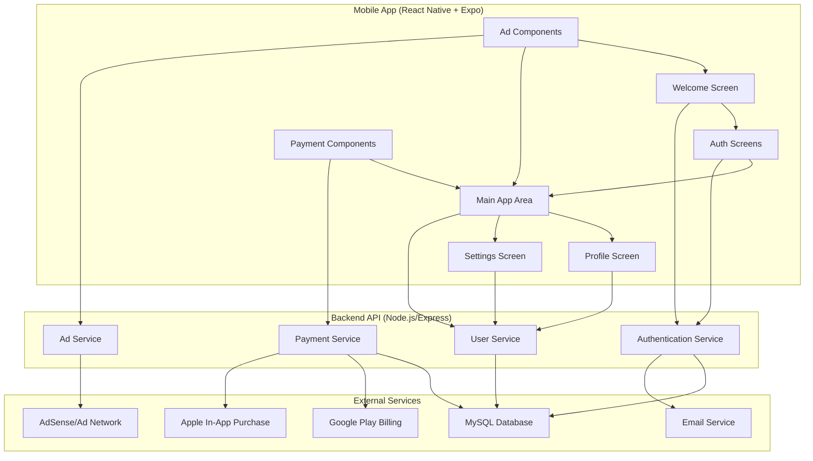

# Design Document

## Overview

The mobile app skeleton is designed as a cross-platform foundation using React Native with Expo for rapid development and deployment. The architecture follows a client-server pattern where the mobile app communicates with a backend API that manages database operations through Prisma ORM connected to MySQL. The design emphasizes modularity, reusability, and scalability to support multiple white-label applications.

## Architecture

### High-Level Architecture



### Technology Stack

**Frontend (Mobile App):**
- React Native with Expo SDK
- Expo Router for navigation
- React Native Paper or NativeBase for UI components
- AsyncStorage for local data persistence
- Expo SecureStore for sensitive data storage

**Backend API:**
- Node.js with Express.js
- Prisma ORM for database operations
- JWT for authentication tokens
- bcrypt for password hashing
- nodemailer for email services

**Database:**
- MySQL for primary data storage
- Redis for session management and caching (optional)

**External Integrations:**
- Google Play Billing API
- Apple In-App Purchase API
- Google AdSense or similar ad network
- Email service provider (SendGrid, AWS SES, etc.)

## Components and Interfaces

### Core Components

#### 1. Authentication Components
- **WelcomeScreen**: Landing page with branding and navigation to auth
- **RegisterScreen**: User registration with validation
- **LoginScreen**: User authentication
- **EmailVerificationScreen**: Email confirmation flow

#### 2. Main Application Components
- **ProfileScreen**: User profile management
- **SettingsScreen**: App preferences and account settings
- **PremiumScreen**: Subscription and payment options

#### 3. White-label Components
- **ThemeProvider**: Configurable theming system
- **BrandingWrapper**: Customizable branding elements
- **ConfigurableButton**: Themed button component
- **ConfigurableInput**: Themed input component

#### 4. Advertisement Components
- **BannerAd**: Display banner advertisements
- **InterstitialAd**: Full-screen video advertisements
- **AdManager**: Handles ad loading and display logic

#### 5. Payment Components
- **SubscriptionManager**: Handles recurring payments
- **OneTimePurchase**: Handles single payments
- **PaymentProvider**: Platform-specific payment integration

### API Interfaces

#### Authentication Endpoints
```typescript
POST /api/auth/register
POST /api/auth/login
POST /api/auth/verify-email
POST /api/auth/refresh-token
POST /api/auth/logout
```

#### User Management Endpoints
```typescript
GET /api/users/profile
PUT /api/users/profile
PUT /api/users/password
DELETE /api/users/account
```

#### Payment Endpoints
```typescript
GET /api/payments/plans
POST /api/payments/subscribe
POST /api/payments/purchase
GET /api/payments/status
POST /api/payments/webhook
```

## Data Models

### Database Schema

```prisma
model User {
  id            String   @id @default(cuid())
  email         String   @unique
  nickname      String
  passwordHash  String
  isVerified    Boolean  @default(false)
  verificationToken String?
  premiumStatus PremiumStatus @default(FREE)
  premiumExpiry DateTime?
  createdAt     DateTime @default(now())
  updatedAt     DateTime @updatedAt
  
  payments      Payment[]
  sessions      Session[]
}

model Payment {
  id            String      @id @default(cuid())
  userId        String
  type          PaymentType
  amount        Float
  currency      String
  status        PaymentStatus
  platformId    String?     // Store ID from Google Play/App Store
  createdAt     DateTime    @default(now())
  
  user          User        @relation(fields: [userId], references: [id])
}

model Session {
  id        String   @id @default(cuid())
  userId    String
  token     String   @unique
  expiresAt DateTime
  createdAt DateTime @default(now())
  
  user      User     @relation(fields: [userId], references: [id])
}

model AppConfig {
  id              String   @id @default(cuid())
  appName         String
  primaryColor    String
  secondaryColor  String
  logoUrl         String?
  paymentModel    PaymentModel
  subscriptionPrice Float?
  oneTimePrice    Float?
  createdAt       DateTime @default(now())
  updatedAt       DateTime @updatedAt
}

enum PremiumStatus {
  FREE
  PREMIUM_SUBSCRIPTION
  PREMIUM_LIFETIME
}

enum PaymentType {
  SUBSCRIPTION
  ONE_TIME
}

enum PaymentStatus {
  PENDING
  COMPLETED
  FAILED
  CANCELLED
}

enum PaymentModel {
  SUBSCRIPTION_ONLY
  ONE_TIME_ONLY
  BOTH
}
```

### Frontend Data Models

```typescript
interface User {
  id: string;
  email: string;
  nickname: string;
  premiumStatus: PremiumStatus;
  premiumExpiry?: Date;
}

interface AppTheme {
  primaryColor: string;
  secondaryColor: string;
  backgroundColor: string;
  textColor: string;
  logoUrl?: string;
}

interface PaymentPlan {
  id: string;
  type: 'subscription' | 'one-time';
  price: number;
  currency: string;
  duration?: string;
  features: string[];
}
```

## Error Handling

### Frontend Error Handling
- **Network Errors**: Retry mechanism with exponential backoff
- **Validation Errors**: Real-time form validation with user-friendly messages
- **Authentication Errors**: Automatic token refresh and re-authentication flow
- **Payment Errors**: Clear error messages and retry options
- **Ad Loading Errors**: Graceful fallback without breaking app functionality

### Backend Error Handling
- **Database Errors**: Connection pooling and retry logic
- **Authentication Errors**: Proper HTTP status codes and error messages
- **Payment Processing Errors**: Webhook handling and transaction verification
- **Email Service Errors**: Queue system for retry attempts
- **Rate Limiting**: Implement rate limiting to prevent abuse

### Error Response Format
```typescript
interface ErrorResponse {
  success: false;
  error: {
    code: string;
    message: string;
    details?: any;
  };
}
```

## Testing Strategy

### Frontend Testing
- **Unit Tests**: Jest for component logic and utility functions
- **Integration Tests**: Testing Library for component interactions
- **E2E Tests**: Detox for full user flow testing
- **Visual Tests**: Storybook for component documentation and testing

### Backend Testing
- **Unit Tests**: Jest for service layer and utility functions
- **Integration Tests**: Supertest for API endpoint testing
- **Database Tests**: In-memory database for isolated testing
- **Load Tests**: Artillery or similar for performance testing

### Test Coverage Goals
- Minimum 80% code coverage for critical paths
- 100% coverage for authentication and payment flows
- Automated testing in CI/CD pipeline

### Testing Environments
- **Development**: Local testing with test database
- **Staging**: Production-like environment for integration testing
- **Production**: Monitoring and error tracking with Sentry or similar

## Security Considerations

### Authentication Security
- JWT tokens with short expiration times
- Refresh token rotation
- Secure password hashing with bcrypt
- Email verification for account activation

### Data Protection
- HTTPS/TLS for all API communications
- Sensitive data encryption at rest
- PII data handling compliance (GDPR, CCPA)
- Secure storage of payment information

### Mobile App Security
- Certificate pinning for API communications
- Secure storage for sensitive data (Expo SecureStore)
- Code obfuscation for production builds
- Runtime application self-protection (RASP)

## Performance Optimization

### Frontend Optimization
- Lazy loading of screens and components
- Image optimization and caching
- Bundle splitting and code splitting
- Offline capability with AsyncStorage

### Backend Optimization
- Database query optimization with Prisma
- Caching strategy with Redis
- API response compression
- Connection pooling for database

### Monitoring and Analytics
- Performance monitoring with Flipper or Reactotron
- Crash reporting with Sentry
- User analytics with appropriate privacy considerations
- API performance monitoring