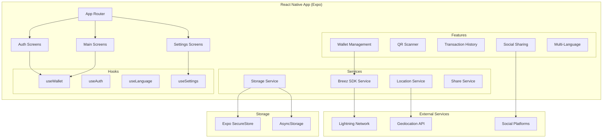

# Design Document: Zap Arc Mobile Wallet

## Overview

The Zap Arc Mobile Wallet is a React Native (Expo) application that provides comprehensive Lightning Network tipping functionality with hierarchical multi-wallet support, location-based language switching, and social media integration. The app uses Expo Router for navigation, React Native Paper for Material Design UI components, Expo SecureStore for secure data storage, and Breez SDK for Lightning Network operations. The architecture follows React Native best practices with feature-based organization, custom hooks for state management, and comprehensive internationalization support.

## Architecture

### Code Reuse Strategy

The mobile app copies and adapts non-framework specific logic from the zap-arc browser extension, refactoring it into React Native best practices:

| Source (zap-arc) | Target (mobile) | Refactoring Approach |
|------------------|-----------------|---------------------|
| `src/utils/lnurl.ts` | `src/utils/lnurl.ts` + `src/hooks/useLnurl.ts` | Keep pure functions as utils, wrap stateful operations in hook |
| `src/utils/wallet-manager.ts` | `src/hooks/useWallet.ts` + `src/services/breez-sdk.ts` | Refactor class into hook + service layer |
| `src/utils/mnemonic-derivation.ts` | `src/utils/mnemonic-derivation.ts` | Copy as-is (pure utility functions) |
| `src/types/index.ts` | `src/types/index.ts` | Copy and adapt, remove Chrome-specific types |

**Refactoring patterns:**
- `WalletManager` class → `useWallet` hook (state) + `BreezSDKService` (SDK operations)
- `LnurlManager` class → pure utility functions + `useLnurl` hook for stateful operations
- `ChromeStorageManager` → `useStorage` hook wrapping Expo SecureStore + AsyncStorage
- Keep pure functions (validation, parsing, derivation) as standalone utilities

### High-Level Architecture



### Component Architecture

The application follows Expo Router file-based routing with feature-based organization:

```
app/
├── (auth)/                    # Authentication flow
│   ├── welcome.tsx           # Welcome/onboarding screen
│   ├── wallet-selection.tsx  # Show all wallets selection
│   ├── pin-entry.tsx         # PIN entry for selected wallet
│   ├── create-wallet.tsx     # Wallet creation
│   ├── import-wallet.tsx     # Wallet import
│   └── _layout.tsx           # Auth layout
├── (main)/                   # Main app screens
│   ├── (tabs)/              # Tab navigation
│   │   ├── home.tsx         # Home/balance screen
│   │   ├── scan.tsx         # QR code scanner
│   │   ├── history.tsx      # Transaction history
│   │   ├── wallets.tsx      # Multi-wallet management
│   │   └── _layout.tsx      # Tab layout
│   ├── tip-creator.tsx      # Tip request creation
│   ├── payment-confirm.tsx  # Payment confirmation
│   ├── wallet-details.tsx   # Individual wallet details
│   └── _layout.tsx          # Main layout
├── settings/                 # Settings screens
│   ├── index.tsx            # Main settings
│   ├── language.tsx         # Language selection
│   ├── domains.tsx          # Domain management
│   ├── blacklist.tsx        # LNURL blacklist
│   └── backup.tsx           # Wallet backup
└── _layout.tsx              # Root layout
```

## Components and Interfaces

### 1. Core Services

#### Breez SDK Service (`src/services/breez-sdk.ts`)

**Responsibilities:**
- Lightning Network wallet initialization and management
- Payment processing (send/receive)
- LNURL operations and Lightning address resolution
- Transaction history and balance management
- Multi-wallet support with mnemonic derivation

**Key Interfaces:**
```typescript
interface BreezSDKService {
  // Wallet Management
  initializeWallet(mnemonic: string): Promise<void>
  disconnectWallet(): Promise<void>
  getBalance(): Promise<number>
  getNodeInfo(): Promise<NodeInfo>
  
  // Payment Operations
  generateInvoice(amount: number, description: string): Promise<string>
  sendPayment(bolt11: string): Promise<PaymentResult>
  payLnurl(lnurl: string, amount: number, comment?: string): Promise<LnurlPayResult>
  
  // LNURL Operations
  parseLnurl(lnurl: string): Promise<LnurlData>
  generateReceiveLnurl(): Promise<string>
  
  // Lightning Address Support
  resolveLightningAddress(address: string): Promise<string>
  validateLightningAddress(address: string): boolean
  
  // Transaction Management
  listPayments(): Promise<Transaction[]>
  getPaymentDetails(paymentHash: string): Promise<PaymentDetails>
}
```

#### Storage Service (`src/services/storage.ts`)

**Responsibilities:**
- Secure storage of wallet mnemonics using Expo SecureStore
- App settings and preferences using AsyncStorage
- Multi-wallet metadata management
- Domain and blacklist data persistence

**Key Interfaces:**
```typescript
interface StorageService {
  // Secure Wallet Storage
  saveEncryptedWallet(walletData: WalletData, pin: string): Promise<void>
  loadEncryptedWallet(pin: string): Promise<WalletData | null>
  deleteWallet(walletId: string): Promise<void>
  
  // Multi-Wallet Management
  saveMultiWalletData(data: MultiWalletStorage): Promise<void>
  loadMultiWalletData(): Promise<MultiWalletStorage | null>
  addMasterKey(mnemonic: string, nickname: string): Promise<string>
  addSubWallet(masterKeyId: string, nickname: string): Promise<number>
  
  // Settings Management
  saveUserSettings(settings: UserSettings): Promise<void>
  loadUserSettings(): Promise<UserSettings>
  saveDomainSettings(domains: DomainSettings): Promise<void>
  saveBlacklist(blacklist: BlacklistData): Promise<void>
  
  // App State
  setWalletUnlocked(unlocked: boolean): Promise<void>
  isWalletUnlocked(): Promise<boolean>
}
```

#### Location Service (`src/services/location.ts`)

**Responsibilities:**
- Device location detection for language switching
- Country code determination
- Location permission management

**Key Interfaces:**
```typescript
interface LocationService {
  requestLocationPermission(): Promise<boolean>
  getCurrentLocation(): Promise<LocationData>
  getCountryCode(): Promise<string>
  isInBulgaria(): Promise<boolean>
}

interface LocationData {
  latitude: number
  longitude: number
  country: string
  countryCode: string
}
```

### 2. Custom Hooks

#### useWallet Hook (`src/hooks/useWallet.ts`)

**Responsibilities:**
- Wallet state management and operations
- Multi-wallet switching and management
- Balance and transaction updates
- Payment processing coordination

**Key Interface:**
```typescript
interface UseWalletReturn {
  // Wallet State
  isConnected: boolean
  isUnlocked: boolean
  balance: number
  activeWallet: ActiveWalletInfo | null
  wallets: WalletMetadata[]
  
  // Wallet Operations
  createWallet: (nickname: string) => Promise<WalletData>
  importWallet: (mnemonic: string, nickname: string) => Promise<WalletData>
  switchWallet: (masterKeyId: string, subWalletIndex?: number) => Promise<void>
  unlockWallet: (pin: string) => Promise<void>
  lockWallet: () => Promise<void>
  
  // Sub-Wallet Management
  addSubWallet: (masterKeyId: string, nickname: string) => Promise<void>
  renameWallet: (masterKeyId: string, subWalletIndex: number, nickname: string) => Promise<void>
  archiveSubWallet: (masterKeyId: string, subWalletIndex: number) => Promise<void>
  restoreSubWallet: (masterKeyId: string, subWalletIndex: number) => Promise<void>
  
  // Master Wallet Management
  archiveMasterWallet: (masterKeyId: string) => Promise<void>
  restoreMasterWallet: (masterKeyId: string) => Promise<void>
  deleteMasterWallet: (masterKeyId: string) => Promise<void>
  
  // Sub-Wallet Creation Logic
  canCreateSubWallet: (masterKeyId: string) => boolean
  getNextAvailableSubWalletIndex: (masterKeyId: string) => number
  
  // Payment Operations
  generateInvoice: (amount: number, description: string) => Promise<string>
  sendPayment: (destination: string, amount: number) => Promise<PaymentResult>
  
  // Transaction Management
  transactions: Transaction[]
  refreshTransactions: () => Promise<void>
  getTransactionDetails: (id: string) => Promise<PaymentDetails>
}
```

#### useLanguage Hook (`src/hooks/useLanguage.ts`)

**Responsibilities:**
- Language detection and switching
- Internationalization state management
- Location-based language selection

**Key Interface:**
```typescript
interface UseLanguageReturn {
  currentLanguage: 'en' | 'bg'
  isLocationBased: boolean
  availableLanguages: LanguageOption[]
  
  setLanguage: (language: 'en' | 'bg') => Promise<void>
  detectLocationLanguage: () => Promise<void>
  t: (key: string, params?: Record<string, any>) => string
}

interface LanguageOption {
  code: 'en' | 'bg'
  name: string
  nativeName: string
  flag: string
}
```

#### useAuth Hook (`src/hooks/useAuth.ts`)

**Responsibilities:**
- Wallet selection and PIN authentication flow
- Session management and auto-lock functionality
- Master wallet PIN validation for sub-wallet access

**Key Interface:**
```typescript
interface UseAuthReturn {
  // Authentication State
  isAuthenticated: boolean
  selectedWallet: WalletSelectionInfo | null
  availableWallets: WalletHierarchy[]
  
  // Wallet Selection Flow
  showAllWallets: () => void
  selectWallet: (masterKeyId: string, subWalletIndex?: number) => void
  authenticateWithPin: (pin: string) => Promise<boolean>
  
  // Session Management
  lockWallet: () => void
  isSessionActive: (masterKeyId: string) => boolean
  extendSession: () => void
  
  // Auto-lock
  startAutoLockTimer: () => void
  resetAutoLockTimer: () => void
}

interface WalletSelectionInfo {
  masterKeyId: string
  masterKeyNickname: string
  subWalletIndex: number
  subWalletNickname: string
}

interface WalletHierarchy {
  masterKey: MasterKeyMetadata
  subWallets: SubWalletEntry[]
  isExpanded: boolean
}
```

**Responsibilities:**
- App settings state management
- Domain and blacklist management
- User preferences coordination

**Key Interface:**
```typescript
interface UseSettingsReturn {
  settings: UserSettings
  domainSettings: DomainSettings
  blacklist: BlacklistData
  
  updateSettings: (updates: Partial<UserSettings>) => Promise<void>
  setDomainStatus: (domain: string, status: DomainStatus) => Promise<void>
  addToBlacklist: (lnurl: string) => Promise<void>
  removeFromBlacklist: (lnurl: string) => Promise<void>
  clearBlacklist: () => Promise<void>
}
```

### 3. Feature Components

#### QR Scanner Component (`src/features/scanner/QRScanner.tsx`)

**Responsibilities:**
- Camera-based QR code scanning
- Lightning invoice, LNURL, and Lightning address detection
- Payment flow initiation

**Key Features:**
- Expo Camera integration
- Real-time QR code detection
- Multiple format support (bolt11, LNURL, Lightning address)
- Flashlight toggle
- Manual input fallback

#### Tip Creator Component (`src/features/tipping/TipCreator.tsx`)

**Responsibilities:**
- Tip request generation and customization
- Social media sharing integration
- QR code generation for tip requests

**Key Features:**
- Amount configuration (3 suggested amounts)
- LNURL/Lightning address selection
- Platform-specific sharing
- QR code generation and display
- Copy to clipboard functionality

#### Multi-Wallet Manager (`src/features/wallets/MultiWalletManager.tsx`)

**Responsibilities:**
- Hierarchical wallet display and management
- Master key and sub-wallet operations
- Wallet switching and organization

**Key Features:**
- Expandable master key lists
- Sub-wallet creation and management
- Balance display across wallets
- Drag-and-drop reordering
- Archive/restore functionality

## Data Models

### Core Data Structures

```typescript
// Wallet Management
interface WalletData {
  mnemonic: string
  balance: number
  lnurl?: string
  lightningAddress?: string
  transactions: Transaction[]
}

interface MultiWalletStorage {
  masterKeys: MasterKeyEntry[]
  activeMasterKeyId: string
  activeSubWalletIndex: number
  version: number
}

interface MasterKeyEntry {
  id: string
  nickname: string
  encryptedMnemonic: EncryptedData
  subWallets: SubWalletEntry[]
  archivedSubWallets: SubWalletEntry[]  // New: separate array for archived sub-wallets
  createdAt: number
  lastUsedAt: number
  isExpanded: boolean
  archivedAt?: number // Timestamp when master key was archived (undefined = active)
  canCreateSubWallets: boolean  // New: true if last sub-wallet has transaction history
}

interface SubWalletEntry {
  index: number
  nickname: string
  createdAt: number
  lastUsedAt: number
  hasActivity: boolean
  hasTransactionHistory: boolean  // New: tracks if wallet has any transactions
  archivedAt?: number // Timestamp when sub-wallet was archived (undefined = active)
}

// Settings and Preferences
interface UserSettings {
  // Language and Localization
  language: 'en' | 'bg'
  isLocationBased: boolean
  currency: 'sats' | 'btc' | 'usd' | 'eur' | 'bgn'
  
  // Wallet Configuration
  useBuiltInWallet: boolean  // true = Breez SDK, false = custom LNURL
  customLNURL?: string       // Custom LNURL-pay address (when useBuiltInWallet is false)
  customLightningAddress?: string  // Alternative Lightning address format
  
  // Tip Configuration
  defaultPostingAmounts: [number, number, number]  // Amounts for tip requests when posting
  defaultTippingAmounts: [number, number, number]  // Amounts when tipping others
  
  // App Behavior
  biometricEnabled: boolean
  autoLockTimeout: number  // In seconds: 300, 900, 1800, 3600, 7200, or 0 (never)
  notificationsEnabled: boolean
  
  // Social Platform Settings (excluding Facebook group management)
  preferredSharingPlatforms: string[]
}

interface DomainSettings {
  [domain: string]: DomainStatus
}

enum DomainStatus {
  UNMANAGED = 'unmanaged',
  WHITELISTED = 'whitelisted', 
  DISABLED = 'disabled'
}

interface BlacklistData {
  lnurls: string[]
  lightningAddresses: string[]
  lastUpdated: number
}

// Transaction and Payment Data
interface Transaction {
  id: string
  type: 'send' | 'receive'
  amount: number
  description?: string
  timestamp: number
  status: 'pending' | 'completed' | 'failed'
  paymentHash?: string
  preimage?: string
  feeSats?: number
  destination?: string
}

interface PaymentResult {
  success: boolean
  paymentHash?: string
  preimage?: string
  amountSats?: number
  feeSats?: number
  error?: string
}

// Social Sharing
interface ShareData {
  tipRequest: string
  qrCodeUri?: string
  platform?: string
  customMessage?: string
}

interface SocialPlatform {
  id: string
  name: string
  icon: string
  maxLength?: number
  supportsImages: boolean
  formatTipRequest: (request: string) => string
}
```

### Storage Schema

```typescript
// Expo SecureStore (Encrypted)
interface SecureStorageSchema {
  // Wallet Data (PIN-encrypted)
  [`wallet_${walletId}`]: string // JSON.stringify(EncryptedWalletData)
  [`masterKey_${masterKeyId}`]: string // JSON.stringify(EncryptedMnemonic)
  
  // Authentication
  walletPin: string // Hashed PIN for verification
  biometricEnabled: string // 'true' | 'false'
}

// AsyncStorage (Unencrypted)
interface AsyncStorageSchema {
  // App Settings
  userSettings: string // JSON.stringify(UserSettings)
  domainSettings: string // JSON.stringify(DomainSettings)
  blacklistData: string // JSON.stringify(BlacklistData)
  
  // Multi-Wallet Metadata
  multiWalletData: string // JSON.stringify(MultiWalletStorage)
  
  // App State
  isWalletUnlocked: string // 'true' | 'false'
  lastActivity: string // timestamp
  appVersion: string
  
  // Language and Localization
  selectedLanguage: string // 'en' | 'bg'
  locationLanguageDetected: string // 'true' | 'false'
}
```

## Correctness Properties

*A property is a characteristic or behavior that should hold true across all valid executions of a system-essentially, a formal statement about what the system should do. Properties serve as the bridge between human-readable specifications and machine-verifiable correctness guarantees.*

Now I need to use the prework tool to analyze the acceptance criteria before writing the correctness properties:

### Property 1: BIP39 Mnemonic Generation and Validation
*For any* generated mnemonic, it should be a valid 12-word BIP39 mnemonic phrase, and for any valid BIP39 mnemonic input, the system should accept it for wallet import
**Validates: Requirements 1.2, 1.3**

### Property 2: Wallet Data Encryption Round Trip
*For any* wallet data, encrypting then decrypting with the same PIN should produce equivalent wallet data
**Validates: Requirements 1.4**

### Property 3: Lightning Invoice Generation Validity
*For any* valid amount and description, the generated Lightning Network invoice should be a valid bolt11 invoice that can be parsed by Lightning Network implementations
**Validates: Requirements 1.6**

### Property 4: Payment Method Processing Consistency
*For any* valid payment input (QR code, LNURL, Lightning address, or bolt11), the system should correctly identify the payment type and extract the necessary payment information
**Validates: Requirements 1.7**

### Property 5: Auto-lock Timeout Behavior
*For any* app backgrounding event, if the elapsed time exceeds the configured timeout, the system should require authentication to unlock
**Validates: Requirements 1.8**

### Property 6: Location-Based Language Selection
*For any* valid geographic coordinates, if the coordinates are within Bulgaria, the system should select Bulgarian language, otherwise English
**Validates: Requirements 2.2, 2.3, 2.4**

### Property 7: Language Preference Override Persistence
*For any* manual language selection, the system should use the manually selected language regardless of location detection results
**Validates: Requirements 2.5, 2.7**

### Property 8: Content Language Consistency
*For any* generated content (tip requests, payment descriptions), the text should use the currently selected language setting
**Validates: Requirements 2.9**

### Property 9: Tip Request Format Standardization
*For any* tip request creation with LNURL/Lightning address and three amounts, the generated string should follow the exact format "[lntip:lnurl:<address>:<amount1>:<amount2>:<amount3>]"
**Validates: Requirements 3.2, 3.3**

### Property 10: Platform-Specific Sharing Format
*For any* social media platform and tip request, the formatted output should comply with that platform's character limits and formatting conventions
**Validates: Requirements 3.5**

### Property 11: Default Amount Fallback
*For any* tip request creation when no custom amounts are configured, the system should use the default amounts [100, 500, 1000] sats
**Validates: Requirements 3.6**

### Property 12: Custom Amount Persistence
*For any* saved custom tip amounts, subsequent tip request creation should use those saved amounts instead of defaults
**Validates: Requirements 3.7**

### Property 13: QR Code Data Integrity
*For any* generated QR code containing tip request data, decoding the QR code should yield the exact tip request string that was encoded
**Validates: Requirements 3.8**

### Property 14: Lightning Invoice Parsing Accuracy
*For any* valid Lightning invoice QR code, the parsed payment details should match the original invoice data (amount, description, payment hash)
**Validates: Requirements 4.2**

### Property 15: LNURL and Lightning Address Parsing Equivalence
*For any* valid LNURL or equivalent Lightning address, both should parse to the same payment endpoint and capabilities
**Validates: Requirements 4.3**

### Property 16: Tip Request Parsing Round Trip
*For any* valid tip request string, parsing then regenerating should produce an equivalent tip request with the same LNURL and amounts
**Validates: Requirements 4.4**

### Property 17: Payment Processing Result Consistency
*For any* payment attempt, the system should return a consistent result structure indicating success/failure with appropriate error details
**Validates: Requirements 4.6**

### Property 18: Transaction History Update Integrity
*For any* successful payment, the transaction should appear in the history with correct amount, timestamp, and status information
**Validates: Requirements 4.7**

### Property 19: Lightning Address Format Validation
*For any* string input, the system should correctly identify valid Lightning address format (user@domain.tld) and reject invalid formats
**Validates: Requirements 19.1, 19.7**

### Property 20: Lightning Address to LNURL Conversion
*For any* valid Lightning address (user@domain), the conversion should produce the correct LNURL endpoint (https://domain/.well-known/lnurlp/user)
**Validates: Requirements 19.2**

### Property 21: Address Format Support Equivalence
*For any* payment destination, whether specified as LNURL or Lightning address, the system should process them with equivalent functionality
**Validates: Requirements 19.3, 19.4, 19.6**

### Property 23: Master Wallet PIN Authentication for Sub-Wallets
*For any* sub-wallet selection, authentication should succeed with the master wallet's PIN and fail with any other PIN
**Validates: Requirements 21.5, 21.6, 21.7**

### Property 24: Session Persistence Within Master Key
*For any* sub-wallet switching within the same master key during an active session, no additional PIN entry should be required
**Validates: Requirements 21.9**

### Property 25: Cross-Master Key Authentication Requirement
*For any* wallet switch to a different master key, PIN authentication should be required regardless of current session state
**Validates: Requirements 21.10**

### Property 26: Sub-Wallet Creation Transaction History Requirement
*For any* master key, sub-wallet creation should only be enabled if the last created sub-wallet has transaction history
**Validates: Requirements 14.11, 14.12**

### Property 27: Archive Index Preservation
*For any* archived sub-wallet at index N, creating new sub-wallets should skip index N and use the next available index
**Validates: Requirements 23.8, 23.10**

### Property 28: Sub-Wallet Archive Restriction
*For any* sub-wallet, the system should allow archiving and restoring but never permanent deletion
**Validates: Requirements 23.2, 23.4, 23.6**

### Property 29: Master Wallet Deletion Capability
*For any* master wallet, the system should allow archiving, restoring, and permanent deletion with proper confirmation
**Validates: Requirements 23.1, 23.3, 23.5, 23.7**

### Property 30: Archived Sub-Wallet Index Consistency
*For any* restored sub-wallet, it should maintain its original index and derived mnemonic unchanged
**Validates: Requirements 23.12**

## Error Handling

### Error Categories and Strategies

| Error Type | Strategy | User Experience |
|------------|----------|-----------------|
| **Network Errors** | Retry with exponential backoff, offline mode | Clear network status indicators, retry buttons |
| **Wallet Errors** | Graceful degradation, clear error messages | Specific guidance (insufficient balance, channel issues) |
| **Validation Errors** | Immediate feedback, input correction | Real-time validation with helpful error text |
| **Permission Errors** | Clear permission requests, fallback options | Step-by-step permission guidance |
| **Biometric Errors** | PIN fallback, clear error explanation | Seamless fallback to PIN authentication |
| **Storage Errors** | Data recovery attempts, backup prompts | Data integrity warnings, backup suggestions |

### Error Recovery Mechanisms

```typescript
interface ErrorHandler {
  handleNetworkError(error: NetworkError): Promise<ErrorRecovery>
  handleWalletError(error: WalletError): Promise<ErrorRecovery>
  handleValidationError(error: ValidationError): ErrorRecovery
  handlePermissionError(error: PermissionError): Promise<ErrorRecovery>
}

interface ErrorRecovery {
  canRetry: boolean
  retryDelay?: number
  fallbackAction?: string
  userMessage: string
  technicalDetails?: string
}
```

## Testing Strategy

### Dual Testing Approach

The testing strategy employs both **unit tests** and **property-based tests** to ensure comprehensive coverage:

- **Unit tests**: Verify specific examples, edge cases, and integration points
- **Property tests**: Verify universal properties across all inputs using **fast-check** library
- Both approaches are complementary and necessary for robust validation

### Property-Based Testing Configuration

- **Library**: Jest with custom property testing utilities for React Native/TypeScript
- **Minimum iterations**: 100 per property test
- **Test location**: Co-located with source files using `.test.ts` suffix
- **Property annotation**: Each test references its design document property

### Example Property Test

```typescript
// src/services/__tests__/breez-sdk.test.ts
import { BreezSDKService } from '../breez-sdk'

// Custom property testing utility for Jest
function propertyTest<T>(
  name: string,
  generator: () => T,
  predicate: (value: T) => boolean | Promise<boolean>,
  iterations: number = 100
) {
  return test(name, async () => {
    for (let i = 0; i < iterations; i++) {
      const value = generator()
      const result = await predicate(value)
      expect(result).toBe(true)
    }
  })
}

describe('BreezSDKService Properties', () => {
  propertyTest(
    'Property 1: BIP39 Mnemonic Generation and Validation',
    () => Math.floor(Math.random() * 1000), // Random seed
    async (seed) => {
      // Feature: zap-arc-mobile-wallet, Property 1: BIP39 Mnemonic Generation and Validation
      const service = new BreezSDKService()
      const mnemonic = await service.generateMnemonic()
      
      // Generated mnemonic should be valid BIP39
      const isValid = service.validateMnemonic(mnemonic)
      const wordCount = mnemonic.split(' ').length
      
      return isValid && wordCount === 12
    }
  )
  
  propertyTest(
    'Property 9: Tip Request Format Standardization',
    () => ({
      lnurl: `lnurl${Math.random().toString(36).substring(7)}`,
      amount1: Math.floor(Math.random() * 1000000) + 1,
      amount2: Math.floor(Math.random() * 1000000) + 1,
      amount3: Math.floor(Math.random() * 1000000) + 1
    }),
    ({ lnurl, amount1, amount2, amount3 }) => {
      // Feature: zap-arc-mobile-wallet, Property 9: Tip Request Format Standardization
      const tipRequest = generateTipRequest(lnurl, [amount1, amount2, amount3])
      const expectedFormat = `[lntip:lnurl:${lnurl}:${amount1}:${amount2}:${amount3}]`
      
      return tipRequest === expectedFormat
    }
  )
})

// Traditional unit tests for specific examples and edge cases
describe('BreezSDKService Unit Tests', () => {
  test('should generate valid Lightning invoice', async () => {
    const service = new BreezSDKService()
    const invoice = await service.generateInvoice(1000, 'Test payment')
    
    expect(invoice).toMatch(/^lnbc/)
    expect(invoice.length).toBeGreaterThan(100)
  })
  
  test('should validate Lightning address format', () => {
    const service = new BreezSDKService()
    
    expect(service.validateLightningAddress('user@domain.com')).toBe(true)
    expect(service.validateLightningAddress('invalid-address')).toBe(false)
    expect(service.validateLightningAddress('user@')).toBe(false)
  })
})
```

### Unit Testing Focus Areas

- **Component Integration**: Screen navigation, hook interactions, service coordination
- **Edge Cases**: Empty states, network failures, invalid inputs
- **Platform-Specific**: iOS/Android differences, permission handling
- **Accessibility**: Screen reader support, keyboard navigation

### End-to-End Testing

- **User Flows**: Complete onboarding, wallet creation, payment processing
- **Cross-Platform**: iOS and Android specific testing
- **Performance**: App startup time, payment processing speed
- **Security**: Biometric authentication, secure storage validation

## Platform-Specific Implementation Details

### iOS Implementation

```typescript
// src/services/platform/ios.ts
class IOSPlatformService {
  async setupBiometrics(): Promise<boolean> {
    // Use Expo LocalAuthentication for Face ID/Touch ID
    const hasHardware = await LocalAuthentication.hasHardwareAsync()
    const isEnrolled = await LocalAuthentication.isEnrolledAsync()
    return hasHardware && isEnrolled
  }
  
  async secureStorage(): Promise<SecureStorageOptions> {
    return {
      keychainService: 'zap-arc-mobile-wallet',
      requireAuthentication: true,
      authenticationPrompt: 'Authenticate to access wallet'
    }
  }
}
```

### Android Implementation

```typescript
// src/services/platform/android.ts
class AndroidPlatformService {
  async setupBiometrics(): Promise<boolean> {
    // Use Expo LocalAuthentication for fingerprint/face unlock
    const hasHardware = await LocalAuthentication.hasHardwareAsync()
    const supportedTypes = await LocalAuthentication.supportedAuthenticationTypesAsync()
    return hasHardware && supportedTypes.length > 0
  }
  
  async secureStorage(): Promise<SecureStorageOptions> {
    return {
      keychainService: 'zap_arc_mobile_wallet',
      encrypt: true,
      requireAuthentication: true
    }
  }
}
```

### Internationalization Implementation

```typescript
// src/services/i18n.ts
interface I18nService {
  translations: {
    en: Record<string, string>
    bg: Record<string, string>
  }
  
  t(key: string, params?: Record<string, any>): string
  setLanguage(language: 'en' | 'bg'): void
  detectLanguageFromLocation(countryCode: string): 'en' | 'bg'
}

// Example translations
const translations = {
  en: {
    'wallet.balance': 'Balance: {amount} sats',
    'payment.confirm': 'Confirm Payment',
    'error.insufficient_balance': 'Insufficient balance for payment'
  },
  bg: {
    'wallet.balance': 'Баланс: {amount} сатошита',
    'payment.confirm': 'Потвърди плащането', 
    'error.insufficient_balance': 'Недостатъчен баланс за плащане'
  }
}
```

This comprehensive design provides a solid foundation for implementing the Zap Arc Mobile Wallet with all the required features, proper error handling, and robust testing strategies using React Native, Expo, and the specified architecture components.